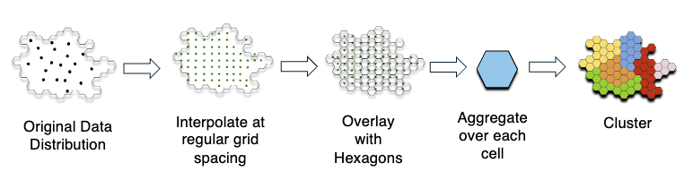

# SCRIBE

**Spatially-Constrained Regionalization for Inference of Broadband Equity**

SCRIBE is the research codebase for the paper [**"Beyond Data Points: Regionalizing Crowdsourced Latency Measurements"**](https://dl.acm.org/doi/10.1145/3700416) (ACM SIGMETRICS 2025). It turns sparse, unevenly distributed crowdsourced broadband measurements into coherent geographic regions that summarize latency performance — enabling policymakers and researchers to reason about internet equity at a regional rather than point-measurement level.

> **Note on data sources:** The original research was conducted using [Ookla](https://www.ookla.com/ookla-for-good) speed test data, which is available only under a Data Use Agreement and cannot be redistributed. This repository demonstrates the same approach using [M-Lab NDT](https://www.measurementlab.net/tests/ndt/) data, which is openly available via BigQuery.

## Motivation

Large-scale crowdsourced measurement platforms (e.g., M-Lab, Ookla) generate millions of broadband performance measurements, but those measurements are spatially uneven: dense in urban cores, sparse in suburban and rural areas. Naive spatial aggregation over administrative boundaries (ZIP codes, census tracts) conflates areas with fundamentally different performance. SCRIBE addresses this by:

1. **Interpolating** raw measurements to a continuous spatial field, filling coverage gaps.
2. **Tessellating** the field into uniform H3 hexagonal cells to remove administrative-boundary bias.
3. **Clustering** the tessellated cells into contiguous regions of statistically similar latency using the SKATER algorithm — producing data-driven broadband equity regions.

## Pipeline



```
Raw measurements → Interpolate to grid → Overlay hexagons → Aggregate per cell → Cluster
```

```bash
make fetch        # pull M-Lab NDT MinRTT data from BigQuery
make interpolate  # interpolate point measurements to a regular grid (default: IDW)
make aggregate    # overlay H3 hexagons; compute per-cell latency distribution stats
make cluster      # SKATER spatial clustering on hex aggregates
make evaluate     # pairwise Adjusted Rand Index stability score across time periods
make all          # interpolate + aggregate + cluster + evaluate
```

All targets operate at the level of a `<City, Date Range>` pair:

```bash
make all \
  CITY=chicago \
  START_DATE=2024-01-01 \
  END_DATE=2024-03-31 \
  GRANULARITY=week \
  METHOD=idw
```

## Setup

Requires Python ≥ 3.11 and [uv](https://docs.astral.sh/uv/).

```bash
make setup   # installs all dependencies via uv sync
```

BigQuery auth uses a service account key file:

```bash
export GOOGLE_APPLICATION_CREDENTIALS=/path/to/key.json
```

Before running the pipeline for a new city, seed its boundary polygon from OSM:

```bash
uv run python src/seed_cities.py
```

## Key Options

| Variable | Default | Description |
|---|---|---|
| `CITY` | `chicago` | City name (must be in `data/cities.geojson`) |
| `START_DATE` / `END_DATE` | `2024-01-01` / `2024-12-31` | Date range |
| `GRANULARITY` | `week` | Sub-period size for stability analysis: `day`, `week`, `month` |
| `METHOD` | `idw` | Interpolation algorithm: `idw`, `loess`, `kde` |
| `RESOLUTION` | `8` | H3 hexagon resolution |
| `N_CLUSTERS` | `auto` | Cluster count, or `auto` to detect via silhouette |
| `DISTANCE` | `Euclidean` | SKATER dissimilarity metric |

## Output

All intermediates and outputs are written to `/data/taveesh/scribe/`:

```
raw/           {city}_{start}_{end}.parquet
interpolated/  {city}_{period_start}_{period_end}_{method}.parquet
aggregated/    {city}_{period_start}_{period_end}_{method}_res{N}.parquet
output/        {city}_{period_start}_{period_end}_{method}_res{N}_clusters.geojson
               {city}_{start}_{end}_{granularity}_{method}_stability.json
```

## Citation

If you use this code, please cite:

```bibtex
@article{sharma2025beyond,
  title={Beyond data points: Regionalizing crowdsourced latency measurements},
  author={Sharma, Taveesh and Schmitt, Paul and Bronzino, Francesco and Feamster, Nick and Marwell, Nicole P},
  journal={Proceedings of the ACM on Measurement and Analysis of Computing Systems},
  volume={8},
  number={3},
  pages={1--24},
  year={2024},
  publisher={ACM New York, NY, USA}
}
```
